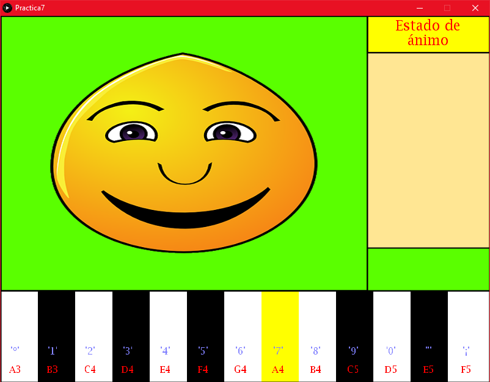
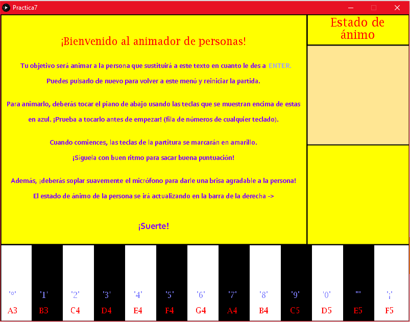

# Procesamiento de audio


## Memoria

### Autor

Kevin David Rosales Santana - <kevin.rosales101@alu.ulpgc.es>

### Índice

1. [Introducción](#1-introducción)
2. [Muestra del resultado](#2-muestra-del-resultado)
3. [Descripción del trabajo realizado](#3-descripción-del-trabajo-realizado)

   3.1 [Estructura de ficheros](#31-estructura-de-ficheros)
   
   3.2 [Decisiones en el desarrollo](#32-decisiones-en-el-desarrollo)
   
      - 3.2.1 [Piano](#321-piano)
      - 3.2.2 [Soplido](#322-soplido)
      - 3.2.3 [Persona](#323-persona)
      - 3.2.4 [Menú y puntuación](#324-menú-y-puntuación)
   
4. [Conclusión](#4-conclusión)
5. [Ejecución del Proyecto](#5-ejecución-del-proyecto)
6. [Referencias y herramientas utilizadas](#6-referencias-y-herramientas-utilizadas)

### 1. Introducción

En la presente práctica se pedía implementar un **prototipo que integrara gráficos y síntesis de sonido**, sirviendo para el aprendizaje de *Processing*, el cual tiene como objetivo facilitar los desarrollos con fines creativos en entornos digitales. 

En este repositorio **se tiene la implementación de un prototipo con el que el usuario puede interactuar de dos formas: [tocando una partitura en el piano (teclas del teclado)](#321-piano) y [soplando suavemente por el micrófono](#322-soplido)**. Con ello, podrá animar en mayor o menor cantidad a [la persona](#323-persona) que se mostrará por pantalla y obtener [una puntuación](#324-menú-y-puntuación) de 0 a 100 por ello.

### 2. Muestra del resultado

<div align="center">
   </img>
   <p>Figura 1: Muestra de resultados</p>
</div>

Aunque no sea obligatorio y no se pueda escuchar el prototipo, se muestra cómo luce visualmente.

### 3. Descripción del trabajo realizado

#### 3.1 Estructura de ficheros

Para realizar este trabajo, se han creado estos cuatro ficheros (presentes en la carpeta [Practica7](Practica7/)):

| Fichero          | Descripción                                                  |
| :--------------- | :----------------------------------------------------------- |
| *Practica7.pde*  | Fichero encargado de la **interfaz gráfica** del proyecto. Además, al ser el fichero principal, gestiona el `setup()` y el `draw()` del proyecto haciendo uso del resto de ficheros de este. Es el encargado de dibujar la interfaz gráfica (piano, persona, estado de humor de la persona y menú) que se puede ver en la *Figura 1* y de gestionar los eventos de teclado (tanto el cambio de menú como el piano). |
| *Controller.pde* | Clase **controlador**. Se encarga de relacionar la gestión de eventos de teclado de la interfaz gráfica (*Práctica7.pde*) con los modelos. También se encarga de capturar la entrada por el micrófono. |
| *Person.pde*     | Clase **modelo** que representa a un objeto *Persona*. Esta persona es representada por ocho imágenes que representan un estado de ánimo visualmente y por un indicador de 0 a 100 que realiza la misma labor numéricamente. |
| *Piano.pde*      | Clase **modelo** que representa a un objeto *Piano*. Este piano es representado por un conjunto de notas musicales y una partitura a tocar. Es el encargado de, haciendo uso de la clase interna *SineInstrument* (que implementa a la interfaz *Instrument*), reproducir sonidos similares a un piano. |

<div align="center">
   <p>Tabla 1: Estructura de ficheros</p>
</div>

#### 3.2 Decisiones en el desarrollo

A la hora de realizar el proyecto se ha tenido que tomar una serie de decisiones respecto al desarrollo de este. A continuación, se listarán dichas decisiones:

##### 3.2.1 Piano

Para que al tocar las teclas se reprodujeran **sonidos similares a un piano**, se usó la clase *SineInstrument*, la cual implementa a la interfaz *Instrument*. Dicha clase es usada por el método `playNote(...)`, el cual se encarga de reproducir el sonido por la línea de salida haciendo uso de *Minim* [(referencia 6)](#6-referencias-y-herramientas-utilizadas):

```java
String[] musicalNotes = { "A3", "B3", "C4", "D4", "E4", "F4", "G4", "A4", "B4", "C5", "D5", "E5", "F5" };

[...]

void playSound(int pianoKeyPressed){
    out.playNote(0, 0.9, new SineInstrument(Frequency.ofPitch(musicalNotes[pianoKeyPressed]).asHz()));
}
```

<div align="center">
   <p>Fragmento de código 1: Reproducción de sonidos similares a piano</p>
</div>


Es importante mencionar que al método `Frequency.ofPitch(String musicalNote)` se le debe pasar una ***String* con la nota que se desea tocar.** Para más información sobre el contenido de `String[] musicalNotes` consultar la [referencia 5](#6-referencias-y-herramientas-utilizadas).

**El controlador es el que realiza la tarea de transformar la tecla que se acaba de pulsar en un índice de `musicalNotes` tras recibir la `key` por parte de la interfaz gráfica.** 

Es necesario mencionar que se crearon dos vectores de  *booleanos* `pianoKeysPressed` y `pianoKeysReleased` para controlar que se pudieran **pulsar múltiples teclas del piano al mismo tiempo** pero **una vez que se pulsara una de ellas, ésta no volviera a sonar hasta que se dejara de pulsar y se pulsara de nuevo.** De esta manera se aseguró un comportamiento lógico en el piano.

##### 3.2.2 Soplido

Para el soplido por el micrófono, se comienza a detectar **la amplitud que se recibe por parte de la entrada de audio** (primer canal). Tras esto, se hace uso del método `capturePuff()`, devolviendo **un valor desde el cual se puede inferir la intensidad con la que se está soplando el micrófono.**

```java
Controller(Practica7 p7, Person person, Piano piano) {
  this.person = person;
  this.piano = piano;
  this.p7 = p7;
    
  IN = new AudioIn(this.p7, 0);
  level = new Amplitude(this.p7);
  level.input(IN);
  IN.start();
    
  [...]
}

float capturePuff(){
  return level.analyze();
}
```

<div align="center">
   <p>Fragmento de código 2: Captura del soplo por el micrófono</p>
</div>

Esta intensidad en un rango, unida con la precisión con la que se está tocando la partitura del [piano](#321-piano), **servirá para animar en mayor o menor cantidad a la persona que se muestra por pantalla.**

<div align="center">
   </img>
   <p>Figura 2: Persona animada por un soplo correcto y una buena partitura tocada.</p>
</div>

##### 3.2.3 Persona

La persona, como se mencionó previamente, es representada por **una secuencia de imágenes que representa estados de humor.** A su vez, contiene una variable `status` (cuyo rango es [0,100], donde 100 es el estado más enfadado y 0 es el más feliz) que se encarga de **representar numéricamente el bienestar de la persona respecto a los esfuerzos del jugador por animarle.**

La variable `status` es modificada en estas tres ocasiones:

- En cada `draw()` que se realiza,  **aumenta en `0.1`.**

- En cada `draw()` que se realiza donde **se detecta un soplo en el micrófono con intensidad `0.01` hasta `0.05` (debe ser suave), se disminuye en `0.25`. **

  - En caso de **no encontrarse en dicho rango** (por no soplar o soplar demasiado fuerte al micrófono), **se aumenta en `0.5`.**

  ```java
  if (controller.capturePuff() > 0.01 && controller.capturePuff() < 0.05) person.changeStatus(-0.25);
  else person.changeStatus(0.5);
  ```

  <div align="center">
     <p>Fragmento de código 3: Puntuación por el soplo por el micrófono</p>
  </div>

- **En cada tecla que se toca correspondiente a la partitura pedida** (marcada en amarillo por la interfaz), **se disminuye en `4`.**

  - **Si se toca la tecla incorrecta, se aumenta en `7.5`.**

  ```java
  if (i == piano.pianoSheet[piano.pianoSheetIndex]) {
  	if (piano.changeIndex() == -1){
  		[...]
      }
      person.changeStatus(-4);
  }else{
      person.changeStatus(7.5);
  }
  ```
  <div align="center">
     <p>Fragmento de código 4: Puntuación por tocar las teclas del piano correctas</p>
  </div>

Con esto se consigue el reto de que el jugador **deba interactuar con el piano** teniendo precisión en las teclas que se le pide, **teniendo un tiempo** para llevar a cabo su objetivo si no quiere que el estado anímico de la persona decaiga y **debiendo soplar al mismo tiempo con la intensidad adecuada por el micrófono.**


##### 3.2.4 Menú y puntuación

Por último, se proporciona **un menú que describe las tareas a realizar y los controles para llevarlas a cabo.** Es posible **tocar el piano para ir entrenando antes de comenzar la partida. **

Además, cada vez que se termina el juego al terminar la partitura, **se muestra por pantalla la puntuación alcanzada.**

|           Menú Inicial            |             Puntuación              |
| :-------------------------------: | :---------------------------------: |
|  |  |

<div align="center">
   <p>Tabla 2: Menú inicial y puntuación</p>
</div>


### 4. Conclusión

Esta práctica ha servido una vez más como aprendizaje para *Processing* y, además, se ha tratado de una práctica muy entretenida donde se ha tenido contacto con una herramienta que sirve para aprender **diferentes formas de realizar salidas gráficas y síntesis relacionadas con el sonido.**

*Processing* para ello otorga una serie de funciones muy útiles y con cometidos muy distintos que permiten realizar tareas tan variadas como la que se puede observar en este repositorio. Se ha podido observar cómo el uso de la biblioteca *Sound* [(ver página 137 de la referencia 1)](#6-referencias-y-herramientas-utilizadas) o *Minim* [(ver referencia 6)](#6-referencias-y-herramientas-utilizadas) **puede resultar fundamental a la hora de hacer las tareas relacionadas con el procesamiento de audio de esta práctica. **

Por último, se debe recalcar que gracias a esta séptima práctica de *Creando Interfaces de Usuario*, se ha podido aprender a desarrollar una práctica donde **hay una respuesta gráfica debido a distintos tipos de interacciones auditivas por parte del usuario**: tanto por su micrófono como por las teclas que toque para el piano.

### 5. Ejecución del proyecto

Para ejecutar este proyecto, es necesario:

- Tener instalado [Processing (Referencia 3)](#6-referencias-y-herramientas-utilizadas)
- Tener instalado la librería *Sound*, de *The Processing Foundation* [(ver página 137 de la Referencia 1)](#6-referencias-y-herramientas-utilizadas)
- Tener instalado *Minim* ([Referencia 6](#6-referencias-y-herramientas-utilizadas))

Para ejecutar el proyecto, tan solo se debe abrir el fichero [Practica7.pde](Practica7/Practica7.pde) y darle al botón de ejecutar.

**Nota importante**: se debe disponer de algún dispositivo de entrada de audio (micrófono).

**Consejo:** es posible que el procesamiento de la intensidad del micrófono y el rango donde se encuentra el "soplo correcto" esté adaptado a **una sensibilidad y distancia al jugador concretas.** Por favor, en caso de que no funcione:

- **Modifique dicho rango en la línea 46 (por defecto es (0.01, 0.05)) de [Practica7.pde](Practica7/Practica7.pde)** con el rango de valores que detecta *Processing* con su micrófono al soplar levemente por éste devueltos por el método `controller.capturePuff()`.
- O **cancele cualquier tipo de efecto del micrófono en el juego comentando la línea 46 y 47** de [Practica7.pde](Practica7/Practica7.pde).

Se recuerda que como dice la información por pantalla, el inicio del juego se realiza con la tecla `ENTER`.

### 6. Referencias y herramientas utilizadas

- [1] Modesto Fernando Castrillón Santana, José Daniel Hernández Sosa. [Creando Interfaces de Usuario. Guion de Prácticas](https://cv-aep.ulpgc.es/cv/ulpgctp20/pluginfile.php/126724/mod_resource/content/25/CIU_Pr_cticas.pdf)
- [2] Processing Foundation. [Processing Reference.](https://processing.org/reference/)
- [3] Processing Foundation. [Processing Download.](https://processing.org/download/)
- [4] Extrapixel. [GifAnimation Processing Library.](https://github.com/extrapixel/gif-animation)
- [5] *School of Physics*. *UNSW Sidney*. [Note names, MIDI numbers and frequencies](https://newt.phys.unsw.edu.au/jw/notes.html).
- [6] Damien Quartz. [Minim](http://code.compartmental.net/tools/minim/)
- [7] Needpix. [Face images](https://www.needpix.com/photo/download/95248/emoticons-emotions-smilies-faces-yellow-happy-laughing-sad-angry)
